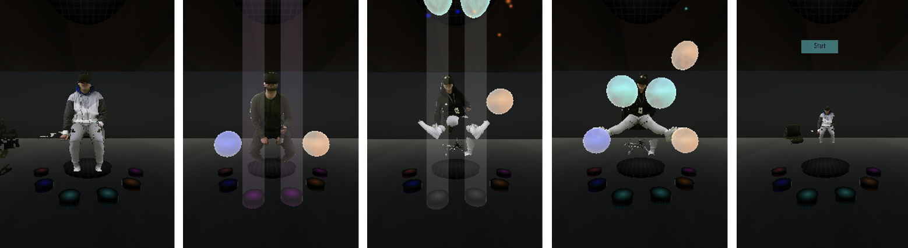
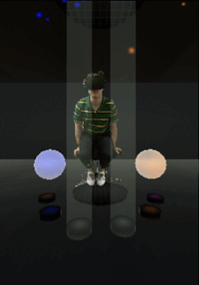
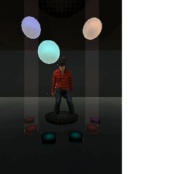
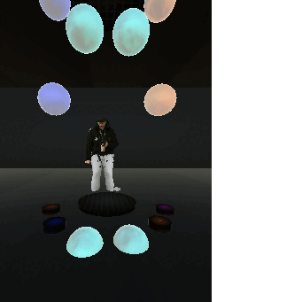

# ISSTA2026-Automated-VR-Testing

## Description
Based on the paper "Automated Usability Prediction in VR Applications via Spatial–Temporal Interactions”.

This repository includes the dataset, documentation, model implementations, experimental results, and labeling code.

## Scope 

The proposed solution is designed to predict the usability of six virtual reality (VR) applications.

Bellow we are going to present examples of usability issues encountered in PhantomLimb:

Figure 1: Examples usability issues, such as: static noise, user avatar misplacement (below the floor or away from the camera), and errors in the user's avatar display.)

Figure 2: Correct Interaction @ 1fps

 

Figure 3: Incorrect interaction - Issue: Misplaced Avatar @ 3fps

 

Figure 4: Incorrect interaction - Issue: Unreachable Target & Fragmented Avatar @ 5fps 

## Contents

This repository contains:
- (1) the full dataset
	- consisting of positional data, and excluding the image data (per IRB specification)
	- saved under: /data
	- details about the data distribution are available at [Dataset Legend](/documentation/Datasets%20Legend.csv)
- (2) tester instructions and data collection guidelines
	- saved under: /documentation
- (3) model (and baseline) implementations
	- saved under: /code/models
	- available at: [Model Implementation](/code/training/Model_Training_and_Evaluation.ipynb)
	- details about the heuristics implementation are available at: [Heuristics Implementation](/documentation/Heuristics.pdf)
- (4) experimental results
	- saved under: /results

Additionally, we attached the implementation used for the labelling process under: /code/labeling

## Usage

### 1.	Data labeling
	Open Data_labeling.ipynb → Set the variables for the current configuration of the data in the "Index" cell →  Set up the correct paths to the data files in the "Read the data from spreadsheet" cell → Run all the cells up to the "Usage" cell → Input the desired range for the data labeling and run the "Usage" cell under "Spatial" and "Temporal" respectively.

Performing the above steps will generate interactive labeling views. These views display both the spatial and image data for each data point, along with label selection options (0 or 1) and an action button that saves the chosen label to the corresponding Google Sheet file.

### 2.	Model training and evaluation
	Open Model_Training_and_Evaluation.ipynb → Run all the subcells in the "PREREQS" cell → Identify the desired model(s) to train and evaluate from the following sections → Run the corresponding code cell

Performing the above steps will load and pre-process the data for model training. Running the code cell for the selected model will train and evaluate the model, then automatically save the model weights and evaluation metrics to Google Drive at the specified path.

## Experimental environment 

For the original experiments, we used Google Colab Pro with the "High RAM" option enabled.

For data handling and access, we uploaded our files to Google Drive under MyDrive.

